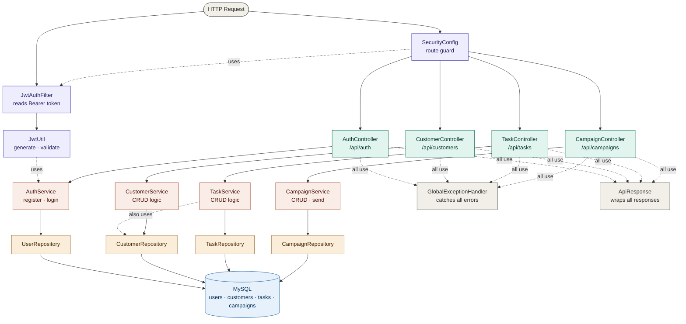

# Mini CRM

> University project — GL Avancé  
> Modular monolith · Spring Boot · MySQL · React · Docker

---

## Stack

| Layer     | Technology                              |
|-----------|-----------------------------------------|
| Frontend  | React 18, Vite, Tailwind CSS, Axios     |
| Backend   | Spring Boot 3.2, Spring Security, JPA   |
| Auth      | JWT (JJWT 0.12)                         |
| Database  | MySQL 8.0                               |
| Docs      | SpringDoc OpenAPI (Swagger UI)          |
| Testing   | JUnit 5, Mockito                        |
| DevOps    | Docker Compose, GitHub Actions          |

---

## Prerequisites

- Java 17+
- Maven 3.9+
- Node.js 20+
- Docker + Docker Compose

---
# Backend — Communication Diagram



## Key relationships

- **HTTP request** enters through `JwtAuthFilter` (reads token) and `SecurityConfig` (decides if route is public or protected).
- **Controllers** receive the validated request and delegate to their **Service**.
- **Services** contain all business logic and call the **Repository** to access the database.
- **TaskService** also calls `CustomerRepository` to resolve the linked customer when creating a task.
- **JwtUtil** is used by `JwtAuthFilter` to validate tokens, and by `AuthService` to generate them on login/register.
- **GlobalExceptionHandler** and **ApiResponse** are cross-cutting — every controller uses them for consistent error and response formatting.
## Quick start

### 1. Clone and configure

```bash
git clone <repo-url>
cd mini-crm
cp .env.example .env
```

### 2. Start MySQL

```bash
docker compose up -d
```

MySQL will be available on `localhost:3306`.  
The schema (`init.sql`) is applied automatically on first start.

### 3. Start the backend

```bash
cd backend
mvn spring-boot:run
```

Backend runs on http://localhost:8080  
Swagger UI: http://localhost:8080/swagger-ui.html

### 4. Start the frontend

```bash
cd frontend
npm install
npm run dev
```

Frontend runs on http://localhost:5173

---

## Running tests

```bash
cd backend
mvn test
```

---

## API overview

| Method | Endpoint                    | Auth | Description            |
|--------|-----------------------------|------|------------------------|
| POST   | /api/auth/register          | No   | Register new user      |
| POST   | /api/auth/login             | No   | Login, returns JWT     |
| GET    | /api/customers              | Yes  | List all customers     |
| POST   | /api/customers              | Yes  | Create customer        |
| PUT    | /api/customers/{id}         | Yes  | Update customer        |
| DELETE | /api/customers/{id}         | Yes  | Delete customer        |
| GET    | /api/tasks                  | Yes  | List all tasks         |
| POST   | /api/tasks                  | Yes  | Create task            |
| PUT    | /api/tasks/{id}             | Yes  | Update task            |
| DELETE | /api/tasks/{id}             | Yes  | Delete task            |
| GET    | /api/campaigns              | Yes  | List all campaigns     |
| POST   | /api/campaigns              | Yes  | Create campaign        |
| PUT    | /api/campaigns/{id}         | Yes  | Update campaign        |
| POST   | /api/campaigns/{id}/send    | Yes  | Send campaign          |
| DELETE | /api/campaigns/{id}         | Yes  | Delete draft campaign  |

---

## Project structure

```
mini-crm/
├── backend/                  Spring Boot modular monolith
│   └── src/main/java/com/minicrm/
│       ├── auth/             Auth module (register, login, JWT)
│       ├── customer/         Customer CRUD
│       ├── task/             Task CRUD
│       ├── campaign/         Campaign CRUD + send
│       ├── config/           Security + OpenAPI config
│       └── shared/           JwtUtil, GlobalExceptionHandler, ApiResponse
├── frontend/                 React + Tailwind
│   └── src/
│       ├── api/              Axios client with JWT interceptor
│       ├── pages/            Login, Register, Customers, Tasks, Campaigns
│       └── components/       Navbar, ProtectedRoute
├── database/
│   └── init.sql              MySQL schema
├── docker-compose.yml        MySQL container
└── .github/workflows/ci.yml  Build + test CI
```
